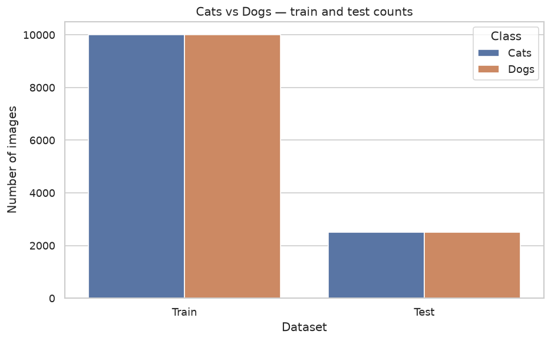
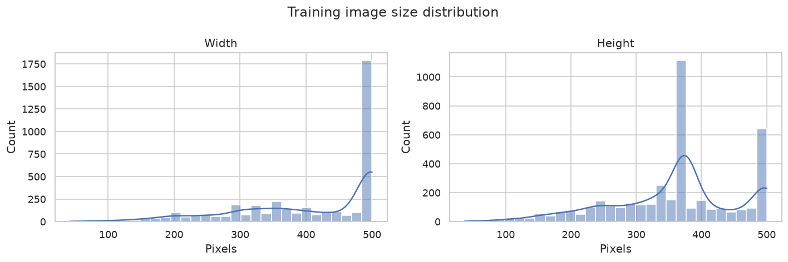
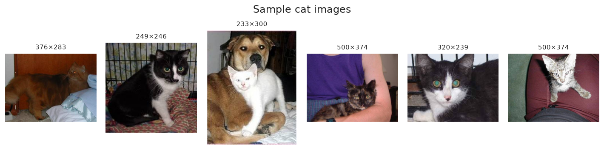
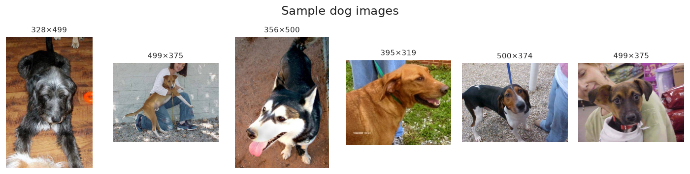
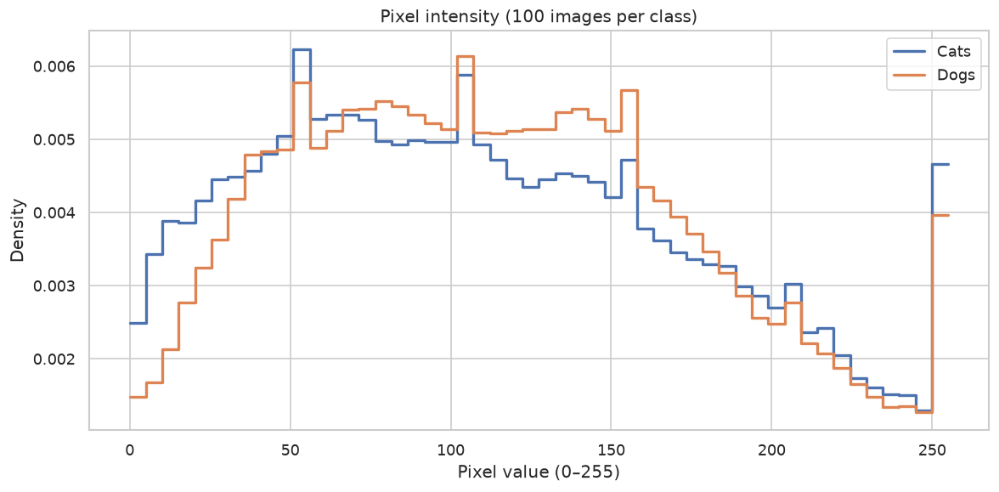
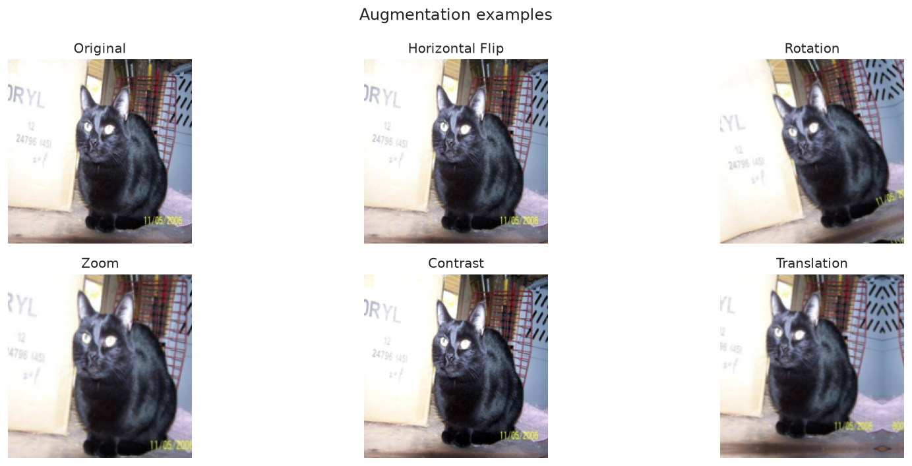

# CNN Image Classifier

Cats vs dogs image classification with TensorFlow and Keras.

## Dataset

Images live under `data/` in ImageFolder layout:

```text
data/
├── train/
│   ├── cats/    # 10,000 images
│   └── dogs/    # 10,000 images
└── test/
    ├── cats/    # 2,500 images
    └── dogs/    # 2,500 images
```

There is no separate validation folder. Training uses 80% of `data/train` (16,000 images) and holds out 20% (4,000 images) as validation.

Raw dataset photos are gitignored. EDA figures in `reports/figures/` are committed so they show on GitHub.

## Project Structure

```text
cnn-image-classifier/
├── data/                      # Train and test images
├── notebooks/
│   ├── eda.ipynb              # Exploratory data analysis
│   └── model_train.ipynb      # Baseline CNN training
├── models/
│   └── baseline.keras         # Saved baseline model
├── reports/figures/           # EDA plots for GitHub
├── requirements.txt
└── README.md
```

## Setup

```bash
python -m venv venv
source venv/bin/activate   # Mac/Linux
# venv\Scripts\activate   # Windows

pip install -r requirements.txt
```

Activate the virtual environment, then open the notebooks in `notebooks/`.

## Exploratory Analysis

`notebooks/eda.ipynb` saves plots to `reports/figures/`.

### Class balance

Train and test splits are even: 10,000 cats and 10,000 dogs in train, 2,500 each in test.



### Image sizes

Widths and heights vary, so images are resized to `150 x 150` before training.



### Sample images





### Pixel intensity

Cat and dog pixel values both span 0–255. The model rescales them to 0–1.



### Data augmentation

Flip, rotation, zoom, contrast, and translation add variety so the model is less likely to overfit.



## Training

`notebooks/model_train.ipynb` loads the data and trains a baseline CNN:

1. **Data load** — path, image size `150 x 150`, batch size `32`
2. **Train, validation, and test** — Keras `image_dataset_from_directory`
3. **Baseline model** — rescale, 3 convolution blocks (32 / 64 / 128 filters), sigmoid output
4. **Train** — 5 epochs with validation
5. **Dump model** — save the trained model to `models/baseline.keras`
6. **Evaluation** — accuracy, precision, recall, F1, and confusion matrix on the test set

Output is one score between 0 and 1: closer to 0 is cat, closer to 1 is dog.
